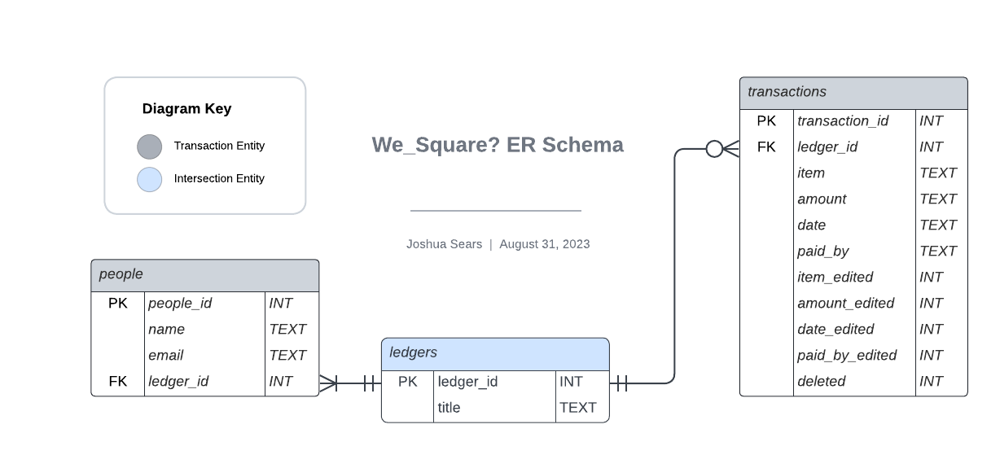

# We_Square?

## About

**We_Square?** is named after the colloquialism, “Are we square?” which we ask each other to determine whether we or not money is owed between parties for shared expenses.

**We_Square?** is an expense tracking application with full data persistence in which users can record and balance shared expenses with any number of people.

### Version: Pre-release 0.4.0

## Installation

[COMING SOON]

## User Guide

We_Square? is a shared expense tracker. A user can have any number of ongoing ledgers, each ledger managing expenses and transactions between 2 or more parties.
Example work flow: 
1. Create a new ledger. Give your ledger a recognizable title, add as many people to the ledger as you like with just their name and email address.
2. Start recording transactions. A transaction is an itemized expense on the ledger. Record a name for the item (ex: "Pizza," "Go karts," etc.), the expense total, the date of the expense, and select who on the ledger paid for it.
3. A summary is continuously displayed and updated as items are added to the ledger. The summary includes the expense total and the amount each person on the ledger is responsible for (expense total / number of people). Additionally, it keeps running totals of each person's contributions (sum of how much people have paid so far), and thus who owes who and how much is owed to balance out the ledger.
4. Party's can itemize transactions between two people on the ledger, representing payment from one person to another.
5. Finally, a full itemized list of transactions and summary may be shared with all parties on the ledger via the emails that were registered from step one.

Note: Because the nature of expense tracking is transactional, and because people who share a ledger may wish to also see in full transparency if any items had been edited or deleted, We_Square? also logs such changes until the entire ledger is deleted by the user.

## Development
**We_Square?**  It is developed using Python and embedded SQLite queries with a model-view-control architecture. Models designed on Lucid.app. 

### Python 3.11 Libraries:
  - datetime
  - json
  - math
  - re
  - smtplib
  - socket
  - sqlite3
  - tkinter
  - webbrowser

### Database Schema

### Authors
Joshua Sears, 2023
